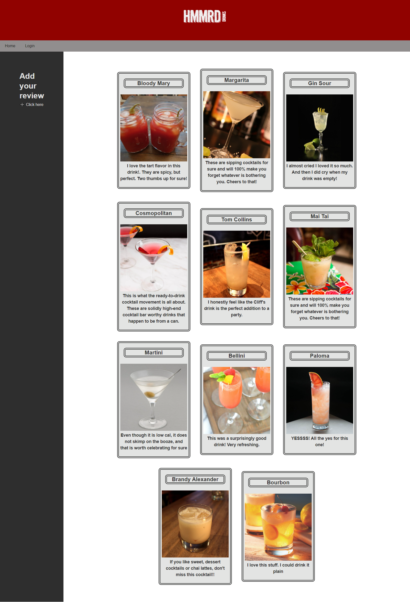

# HMMRD

## Project Description 
It’s not like we need a reason to drink. Any reason is a reason to drink, right? People generally tend to drink alcohol in order to have fun. Being drunk makes them feel happy and spirited, and drinking alcohol with friends can be a fun experience. If people are nervous in social situations, drinking helps them relax and have more fun. People drink to have fun at parties, nightclubs, barbecues, and more, because they think alcohol enhances their experience.

In this case, I’m pretty sure that this bootcamp is what made us consider a drinking app! When times are stressful, people tend to turn to alcohol. I’m sure most of you would agree with me, and for those of you who might still be on the fence about this, we did a little research and found information on a very reputable site. An article taken from WebMD states that, “several recent studies have suggested that alcohol in moderation offers health benefits and may even help you live longer.” 

Lastly, a large study published shows that light to moderate drinkers lowered their chances of an early death by about 20% compared to non-drinkers.

Enter HMMRD. HMMRD is an app about drinks! What’s amazing about this app is that you are only limited to your imagination. 

## User Story
Given a cocktail API
When I visit the site
Then I am presented with a homepage that allows me to sign in as either a new user or returning user

Given my login credentials are accepted
When I click to enter the site on a secondary page
Then I am progressed to a page showing a list of populated drinks

Given I am in the secondary page that shows popular drinks 
When I find a drink I enjoy, I will then click on that and be taken to a page with that drink
Then I am able to write a review and read existing comments

Given I am in the secondary page that shows popular drinks 
When I look to the side navigation bar I am presented with a new review option
Then I click on the plus sign and create a new review

Given that I want to add my own drink review
When I click to add a new review, add my drink of choice 
Then I am presented with a way to add comments for that drink review

## Acceptance Criteria

The user will go to our app. In the left hand corner, they will be able to login. If the are a new user, they will need to sign up. Once logged in, they will then be shown populated drinks. The user will find a drink they are interested in and click on the title. They are taken to a page with the chosen drink. They will be able to review comments and add their own comments. If they are unable to find the drink they want, they can then search a drink in the Create New Drink review box this drink will be added to the main page as a populated drink and then they will be able to add additional comments if they want or the next user will be able to see this drink and make their review.  

## Mock-UP

## Getting Started
You will need to clone the github repository and then run npm install. 
Run `npm run seed` to seed data to your database so that you can test your routes.
Use environment variables to store sensitive data like your MySQL username, password, and database name.
Node server.js and interact with the app

## Technologies Used
HTML - This is the framing tool we used
CSS - Used for styling
Javascript - Used for front and backend functionality
Node JS and Express JS servers
Bootstrap - Page Layout
Axios for API
API - Cocktail API
Handlebars.js
MYSQL database with ORM
Heroku

## Team 
Noah Blackburn
Ludude Lubin
Dwight Kornbluth
Tammy Gagliano

## Project Links:
Github Repository Link:     https://github.com/blackman3178/HMMRD.git